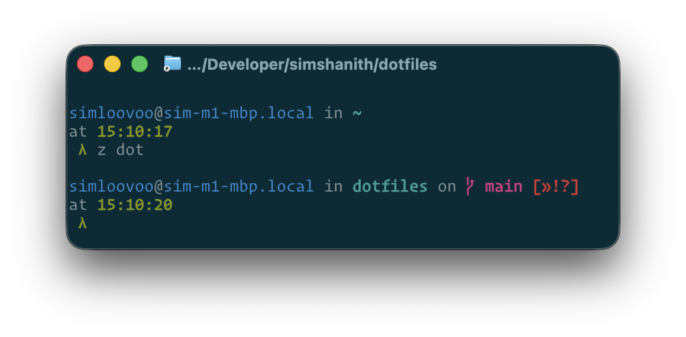

# dotfiles

Personal macOS (Apple Silicon) dotfiles for zsh, managed with
[chezmoi](https://www.chezmoi.io/) + [mise](https://mise.en.dev/). One
idempotent bootstrap brings a fresh machine — or a headless box — up to a full
shell, toolchain, and editor setup.



## Quick start

Fresh machine, one-liner (self-clones to `~/.dotfiles`):

```bash
bash -c "$(curl -fsSL https://raw.githubusercontent.com/simshanith/dotfiles/main/install.sh)"
```

Or from a clone:

```bash
git clone https://github.com/simshanith/dotfiles.git ~/.dotfiles
~/.dotfiles/install.sh
exec zsh
```

`install.sh` is idempotent and safe to re-run. It: installs Homebrew (which
pulls Xcode CLT → `git`) → `brew bundle` (shells, casks, terminfo) → `chezmoi
init --apply` (symlinks dotfiles, renders templates, prompts once for
name/email/work/machine) → `mise install` (the CLI toolchain). The first
`chezmoi` run is bootstrapped via `mise exec` to break the chicken-and-egg where
chezmoi itself lives in the mise baseline.

Verify:

```bash
echo $SHELL              # /opt/homebrew/bin/zsh
which brew               # /opt/homebrew/bin/brew
mise doctor              # toolchain healthy
chezmoi status           # empty = $HOME matches the repo
```

## Architecture

Four tools, clear lanes:

| Tool | Owns | Lives in |
|------|------|----------|
| **chezmoi** (`mode = symlink`) | dotfiles, templates, per-machine data | repo root (`dot_*`, `private_*`, `*.tmpl`) |
| **mise** | CLI toolchain (node, rust, go, bun, starship, ripgrep, chezmoi itself, LSP servers…) | `dot_config/mise/conf.d/fresh.toml` (shared) + `config.local.toml` (per-machine) |
| **uv** | Python interpreters, venvs, one-off scripts (`uv run`); executes mise's `pipx:` tools | declared as `pipx:<pkg>` in `fresh.toml` |
| **Homebrew** | shells, system PATH replacements, GUI casks, fonts, terminfo, keychain-integrated tools | `Brewfile` (+ `Brewfile.optional`) |

### chezmoi source naming

Source files use chezmoi's encoding; chezmoi decodes them on apply:

- `dot_zshrc` → `~/.zshrc`
- `private_dot_emacs.d/` → `~/.emacs.d/` (the `private_` prefix preserves `0700`-style perms)
- `*.tmpl` → rendered templates (e.g. `dot_gitconfig.tmpl` folds in git identity)
- `private_bin/` → `~/bin` (e.g. `executable_cross_origin_chrome`)

Daily use: `chezmoi status` / `chezmoi diff` / `chezmoi apply` / `chezmoi edit`.
Per-machine answers (name/email/work/machine) live in
`~/.config/chezmoi/chezmoi.toml` — prompted by `chezmoi init`, never committed.

> Several configs are symlinked straight into the repo (e.g. `~/.zshrc` sources
> `shell/*.sh` directly from `$DOTFILES`, and `~/.emacs.d/init.el` is a symlink
> into `private_dot_emacs.d/`). Edits to those are live; no `chezmoi apply` round-trip.

## What's inside

- **Shell** — zsh (`dot_zshrc`) sourcing shell-agnostic helpers from `shell/*.sh`
  (`exports`, `path`, `aliases`, `functions`, `dircolors`); **Starship** prompt;
  zoxide, fzf, history-substring-search.
- **Git** — `dot_gitconfig.tmpl` (templated identity), git-delta for diffs.
- **tmux** — `dot_tmux.conf` sourcing the vendored seebi solarized theme.
- **Emacs** — Emacs 30 config (`private_dot_emacs.d/init.el`) for polyglot dev
  (TS/Rust/YAML/JSON/Markdown via tree-sitter + Eglot). See **[emacs.md](./emacs.md)**.
- **Terminal** — Ghostty is primary (`dot_config/ghostty/config`); iTerm2 kept as
  a secondary for `tmux -CC` control mode (its prefs are intentionally unmanaged).
- **mise baseline** — shared tool set in `conf.d/fresh.toml`.
- **`private_bin/`** — small scripts deployed to `~/bin`.
- **Vendored colors** — seebi dircolors / tmux solarized files committed into the
  repo (chezmoi can't fetch remote git the way Fresh did).

## The 2026 refresh

This repo began as a bash + [Bash-It](https://github.com/revans/bash-it) +
[Fresh](http://freshshell.com/) setup (the Paul-Irish-talk era). The 2026 refresh
modernized it end to end — macOS made zsh the default back in Catalina, and the
Intel→Apple-Silicon move (`/usr/local` → `/opt/homebrew`) was overdue.

What changed:

| Old | New | Why |
|-----|-----|-----|
| bash + Bash-It | zsh + `shell/*.sh` | macOS default; shell-agnostic helpers |
| Fresh | **chezmoi** | per-machine templating, no build step, active project |
| nvm | **mise** | polyglot, fast, no shell-startup penalty |
| Bash-It themes | **Starship** | cross-shell, fast |
| fasd | **zoxide** | faster, maintained |
| hub | **gh** | official GitHub CLI |
| Python 2 http.server | Python 3 / **uv** | Py2 EOL |

Added along the way: `bat`, `fd`, `ripgrep`, `fzf`, `git-delta`. The Brewfile was
pared to essentials (dropped `boot2docker`/`docker-machine`/`fig`,
`reattach-to-user-namespace`, discontinued editors, stale `caskroom/*` taps).

**Fresh → chezmoi:** GNU Stow was considered and rejected — the recurring pain
here is *per-machine state* (mise `config.local.toml`, git identity, future
work/personal split), which chezmoi templates solve natively and Stow does not.
`tuckr` was evaluated and dropped. Full rationale and cut-over log:
**[CHEZMOI_MIGRATION.md](./CHEZMOI_MIGRATION.md)**.

**nvm → mise:** mise owns the CLI toolchain via `conf.d/fresh.toml` (committed
baseline) with `config.local.toml` for per-machine tools; `eval "$(mise activate
zsh)"` runs from `.zshrc`. Python is delegated to `uv`.

## Per-machine & headless notes

- **Per-machine data** — `chezmoi init` prompts for name / email / work / machine
  (`.chezmoi.toml.tmpl`) and records them in `~/.config/chezmoi/chezmoi.toml`
  (not committed). Templates read `{{ .name }}` etc. from there.
- **Per-machine tools** — `~/.config/mise/config.toml` is seeded once and
  edit-freely; `config.local.toml` holds overrides. The committed
  `conf.d/fresh.toml` is the shared baseline that every machine gets.
- **Optional extras** — `Brewfile.optional` for things not wanted everywhere.
- **Mostly-headless fleet** — most machines (pi / servers / mac-mini) run
  headless; GUI tooling is opt-in and self-gates on app presence (e.g. App-CLI
  PATH entries in `dot_zprofile`, and Emacs's `exec-path-from-shell` gated to GUI
  sessions). Headless boxes still get the shell + toolchain + terminal Emacs.
