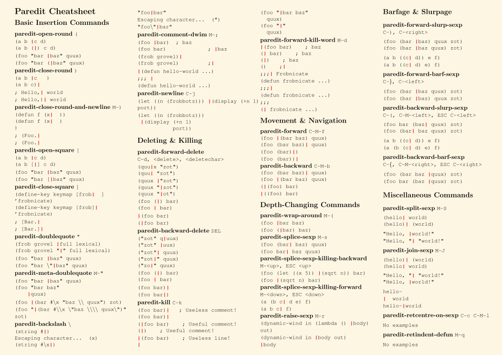

# Cheatsheets

Reference cards for the Emacs setup in this repo (`private_dot_emacs.d/init.el`).
Source-only: listed in `.chezmoiignore`, never deployed to `$HOME`.

## Contents

| File | What | Source |
|------|------|--------|
| [custom-keybindings.md](custom-keybindings.md) | Every keybinding this config adds (fzf, ghostel, magit, apheleia, grip) | **Generated** from init.el — see below |
| [paredit-cheatsheet.svg](paredit-cheatsheet.svg) | Structural editing commands for lisp buffers (paredit is hook-enabled in this config) | [joelittlejohn/paredit-cheatsheet](https://github.com/joelittlejohn/paredit-cheatsheet) |
| [emacs-fundamentals.md](emacs-fundamentals.md) | Links to the official GNU refcards + crib tables for kill/yank/mark and dired | [gnu.org refcards](https://www.gnu.org/software/emacs/refcards/) |

## Paredit at a glance



## Keeping custom-keybindings.md up to date

The table in custom-keybindings.md is regenerated from the `:bind`
declarations in init.el:

```bash
emacs --batch -l cheatsheets/generate-custom-keys.el            # rewrite
emacs --batch -l cheatsheets/generate-custom-keys.el -- --check # CI-style: exit 1 if stale
```

Run the first command whenever a `:bind` changes in init.el and commit the
result. Bindings added outside `use-package :bind` (e.g. raw `global-set-key`)
won't be picked up — prefer `:bind` for anything user-facing.

## Attribution

- `paredit-cheatsheet.svg` © 2013 Joe Littlejohn, © 2008 drewr.usma.edu —
  GNU Free Documentation License, vendored from
  <https://github.com/joelittlejohn/paredit-cheatsheet> with one modification:
  an added `#fdf6e3` background rect (upstream is transparent, unreadable on
  dark backgrounds).
